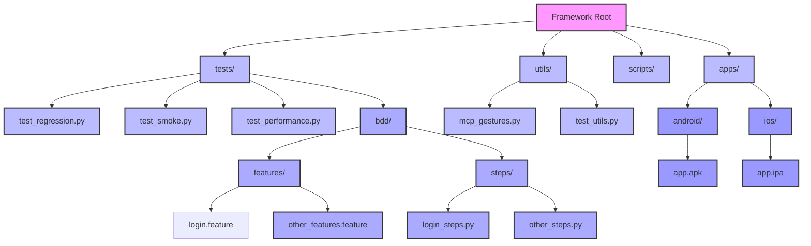

<div align="center">
  <h1 align="center">🚀 Windsurf Mobile Automation Framework</h1>
  <p align="center">
    <strong>Enterprise-Grade Mobile Test Automation with Appium, Python & Pytest</strong>
  </p>
  <p align="center">
    <a href="#features">Features</a>
    ·
    <a href="#quick-start">Quick Start</a>
    ·
    <a href="#aws-device-farm">AWS Device Farm</a>
    ·
    <a href="#jenkins-integration">Jenkins CI/CD</a>
  </p>
  
  <!-- Badges -->
  <p align="center">
    <a href="https://github.com/yogeshwankhede007/windsurf-mobile-automation">
      
    </a>
    <a href="https://www.python.org/downloads/">
      
    </a>
    <a href="https://www.linkedin.com/in/yogesh-wankhede/">
      
    </a>
  </p>
</div>

## ✨ Key Features

<div align="center">
  <table>
    <tr>
      <td align="center">
        
        <h4>Cross-Platform Testing</h4>
        <p>Test on both Android and iOS platforms with unified test cases using Appium and Python</p>
      </td>
      <td align="center">
        
        <h4>Robust Test Framework</h4>
        <p>Page Object Model (POM) design pattern for maintainable and scalable tests</p>
      </td>
      <td align="center">
        
        <h4>AWS Device Farm</h4>
        <p>Seamless integration with AWS Device Farm for testing on real devices in the cloud</p>
      </td>
    </tr>
    <tr>
      <td align="center">
        
        <h4>Jenkins Integration</h4>
        <p>Pre-configured Jenkins pipeline for continuous integration and delivery</p>
      </td>
      <td align="center">
        
        <h4>MCP Appium Gestures</h4>
        <p>Enhanced gesture support with MCP Appium Gestures for smoother and more reliable interactions</p>
      </td>
      <td align="center">
        
        <h4>Flexible Configuration</h4>
        <p>Easy configuration management for different environments and test scenarios</p>
      </td>
    </tr>
  </table>
</div>

## 🚀 Quick Start

### Prerequisites

- Python 3.9+
- Node.js 16+ and npm (for Appium)
- Java Development Kit (JDK) 11 or higher
- Android SDK (for Android testing)
- Xcode (for iOS testing, macOS only)
- Appium 2.0+
- AWS CLI (for AWS Device Farm integration)
- Jenkins (for CI/CD pipeline)

### Installation

1. **Clone the repository**
   ```bash
   git clone git@github.com:yogeshwankhede007/windsurf-mobile-automation.git
   cd windsurf-mobile-automation
   ```

2. **Set up Python environment**
   ```bash
   python -m venv venv
   source venv/bin/activate  # On Windows use `venv\Scripts\activate`
   ```

3. **Install Python dependencies**
   ```bash
   pip install -r requirements.txt
   pip install -r requirements-dev.txt
   ```

4. **BDD Setup**
   ```bash
   # Run BDD tests
   behave tests/bdd/features/login.feature
   
   # Run with Allure reports
   behave -f allure_behave.formatter:AllureFormatter -o allure-results tests/bdd/features/login.feature
   ```

<details>
<summary>4. Install Appium</summary>

```bash
npm install -g appium
```
</details>

<details>
<summary>📱 Managing Mobile Applications</summary>

This framework supports both Android (.apk) and iOS (.ipa) applications. Place your application files in the appropriate directories:

- Android apps: `/apps/android/`
- iOS apps: `/apps/ios/`

You can use the provided script to manage your mobile applications:

```bash
# List all available apps
./scripts/manage_apps.py list

# Add a new Android app
./scripts/manage_apps.py add path/to/your/app.apk --platform android

# Add a new iOS app
./scripts/manage_apps.py add path/to/your/app.ipa --platform ios

# Clean up old app versions (keeps 3 most recent by default)
./scripts/manage_apps.py clean --platform android
./scripts/manage_apps.py clean --platform ios
```
</details>

## 📱 Project Architecture



## 🛠️ Test Execution

<details>
<summary>🛠️ Test Execution</summary>

### Running Tests Locally

#### Using the Test Runner Script

The framework provides a test runner script for easy test execution:

```bash
# Run all tests for Android
./scripts/run_tests.py --platform android

# Run tests on a specific device
./scripts/run_tests.py --platform android --device-udid YOUR_DEVICE_UDID

# Run only smoke tests
./scripts/run_tests.py --platform android --mark smoke

# Run tests in parallel (4 processes)
./scripts/run_tests.py --platform android -n 4

# Install required Appium plugins and run tests
./scripts/run_tests.py --platform android --install-plugins
```

#### Direct Pytest Usage

For more control, you can use pytest directly:

```bash
# Basic test execution with platform specification
pytest tests/ -v --platform=android

# Generate HTML report
pytest tests/ -v --html=reports/report.html --self-contained-html

# Run tests with specific marker
pytest tests/ -v -m smoke

# Run tests in parallel (4 workers)
pytest tests/ -v -n 4
```

## ☁️ AWS Device Farm Integration

This framework includes seamless integration with AWS Device Farm for testing on real devices in the cloud.

### Prerequisites

1. AWS Account with Device Farm access
2. IAM user with `devicefarm:*` permissions
3. AWS credentials configured (`AWS_ACCESS_KEY_ID` and `AWS_SECRET_ACCESS_KEY`)

### Running Tests on AWS Device Farm

Use the provided script to run tests on AWS Device Farm:

```bash
python scripts/run_aws_devicefarm.py \
    --project-name "MyMobileApp" \
    --app-path "apps/android/Android-MyDemoAppRN.1.3.0.build-244.apk" \
    --test-dir "tests" \
    --device-pool "Top Devices" \
    --env-var "ENV=staging" \
    --wait
```

## 🏗️ Jenkins Integration

This framework includes a Jenkins pipeline configuration for continuous integration and delivery.

### Prerequisites

- Jenkins server with the following plugins installed:
  - Pipeline
  - HTML Publisher
  - JUnit
  - Git Plugin
  - AWS Device Farm Plugin (optional)

### Jenkinsfile Configuration

The repository includes two Jenkins pipeline configurations:

1. `Jenkinsfile` - Standard pipeline for local test execution
2. `Jenkinsfile.devicefarm` - Pipeline for AWS Device Farm integration

### Setting Up Jenkins Job

1. Create a new Pipeline job in Jenkins
2. Select "Pipeline script from SCM"
3. Configure your repository URL and credentials
4. Set the script path to either `Jenkinsfile` or `Jenkinsfile.devicefarm`
5. Configure any required environment variables in Jenkins

### Pipeline Parameters

The Jenkins pipeline supports the following parameters:

- `PLATFORM`: Target platform (android/ios)
- `TEST_TYPE`: Type of tests to run (smoke/regression)
- `DEVICE_POOL`: AWS Device Farm device pool (for Device Farm pipeline)
- `ENVIRONMENT`: Test environment (dev/staging/prod)

## 📁 Project Structure

```
windsurf-mobile-automation/
├── apps/                    # Mobile application files
│   ├── android/             # Android APK files
│   └── ios/                 # iOS IPA files
├── config/                  # Configuration files
│   └── config.py            # Main configuration
├── pages/                   # Page Object Models
├── scripts/                 # Utility scripts
├── tests/                   # Test cases
├── utilities/               # Helper utilities
├── .gitignore              
├── Jenkinsfile             # Jenkins pipeline for local execution
├── Jenkinsfile.devicefarm   # Jenkins pipeline for AWS Device Farm
├── pytest.ini              # Pytest configuration
├── README.md               # This file
└── requirements.txt        # Python dependencies
```

## Appium Manager

The `AppiumManager` class provides a high-level interface to manage Appium server and drivers:

```python
from utilities.appium_manager import AppiumManager

# Initialize the manager
with AppiumManager() as manager:
    # Install plugins if needed
    manager.install_plugin('appium-device-farm')
    
    # Start Appium server
    manager.start_appium_server(
        host='127.0.0.1',
        port=4723,
        log_file='appium_server.log'
    )
    
    # Create a driver
    driver = manager.create_driver(
        platform_name='android',
        device_name='emulator-5554',
        app_package='com.example.app',
        app_activity='.MainActivity'
    )
    
    # Your test code here
    
# Server and drivers are automatically cleaned up
```

### Key Features

- **Dynamic Plugin Management**: Install and use Appium plugins at runtime
- **Automatic Resource Cleanup**: Ensures all resources are properly released
- **Cross-Platform Support**: Unified interface for Android and iOS
- **Comprehensive Logging**: Detailed logs for debugging
- **Parallel Execution**: Built-in support for parallel test execution

## Getting Started

### Prerequisites

Before you begin, ensure you have the following installed:

- Python 3.8+
- Node.js and npm (for Appium)
- Java Development Kit (JDK) 8 or higher
- Android SDK (for Android testing)
- Xcode (for iOS testing, macOS only)
- Appium 2.0+

### Installation

```bash
# Clone the repository
git clone git@github.com:yogeshwankhede007/windsurf-mobile-automation.git
cd mobile-automation-framework

# Create and activate a virtual environment
python -m venv venv
source venv/bin/activate  # On Windows use `venv\Scripts\activate`

# Install dependencies
pip install -r requirements.txt
pip install -r requirements-dev.txt
```

## 🧪 Running Tests

### Run All Tests
```bash
pytest tests/ -v
```

### Run Specific Platform
```bash
# Android tests
PLATFORM=android pytest tests/

# iOS tests
PLATFORM=ios pytest tests/
```

### Generate Reports
```bash
# Generate HTML report
pytest --html=reports/report.html

# Generate Allure report
pytest --alluredir=allure-results
allure serve allure-results
```

## 🔄 CI/CD Integration

### GitHub Actions

The framework includes a GitHub Actions workflow that runs on every push and pull request:

```yaml
name: CI

on: [push, pull_request]

jobs:
  test:
    runs-on: macos-latest
    
    steps:
    - uses: actions/checkout@v2
    - name: Set up Python
      uses: actions/setup-python@v2
      with:
        python-version: '3.8'
    - name: Install dependencies
      run: |
        python -m pip install --upgrade pip
        pip install -r requirements.txt
        npm install -g appium
    - name: Run tests
      run: |
        pytest -v --junitxml=test-results/junit.xml
```

### Jenkins Setup

#### Prerequisites
- Jenkins server with the following plugins installed:
  - Pipeline
  - HTML Publisher
  - JUnit
  - GitHub Integration (if using GitHub)
- Appium server running on the Jenkins agent or a remote machine
- Android SDK and Xcode (for iOS) installed on the agent
- Python 3.8+ and pip installed

### Jenkins Pipeline Configuration

1. **Create a New Pipeline Job**
   - Go to Jenkins Dashboard > New Item
   - Enter a name for your job and select "Pipeline"
   - Click OK

2. **Configure Pipeline**
   - Under "Pipeline" section, select "Pipeline script from SCM"
   - Choose your SCM (Git, GitHub, etc.)
   - Enter your repository URL
   - Set the branch to build (e.g., `main` or `master`)
   - Set the script path to `Jenkinsfile`
   - Save the configuration

3. **Environment Variables**
   Ensure the following environment variables are set in Jenkins:
   - `JAVA_HOME`: Path to Java installation
   - `ANDROID_HOME`: Path to Android SDK
   - `PATH`: Should include Python, pip, and Android platform-tools

4. **Build Parameters**
   The pipeline includes the following parameters that you can configure:
   - `RUN_ANDROID_TESTS`: Toggle Android test execution (default: true)
   - `RUN_IOS_TESTS`: Toggle iOS test execution (default: true)

5. **Running the Pipeline**
   - Click "Build with Parameters"
   - Toggle the test platforms as needed
   - Click "Build"

### Post-Build Actions
- Test reports will be available in the "Test Result" section
- HTML reports can be viewed under "HTML Report"
- Build logs contain detailed execution information

### Troubleshooting
- If tests fail with Appium connection issues, verify the Appium server is running
- Ensure all required Python packages are installed (check `requirements.txt` and `requirements-dev.txt`)
- Check Jenkins agent has necessary permissions to run mobile emulators/simulators

## 🔒 Security Considerations

<div class="security-considerations">
  <div class="security-item">
    <h3>🔑 Secure Credential Management</h3>
    <p>All sensitive information is stored securely using environment variables or a vault service. Never commit secrets to version control.</p>
  </div>
  
  <div class="security-item">
    <h3>🔐 Secure Storage</h3>
    <p>Leverage platform-specific secure storage solutions for storing sensitive test data and credentials.</p>
  </div>
  
  <div class="security-item">
    <h3>🌐 Network Security</h3>
    <p>Ensure secure communication with test servers using HTTPS and secure protocols for all API communications.</p>
  </div>
  
  <div class="security-item">
    <h3>🔐 Code Security</h3>
    <p>Regularly update dependencies and follow secure coding practices in test scripts.</p>
  </div>
  
  <div class="security-item">
    <h3>🛡️ Infrastructure Security</h3>
    <p>Secure your CI/CD pipeline with proper access controls and secrets management.</p>
  </div>
</div>

## 📬 Contact

Have questions or feedback? 

- 📧 Email: [tech.yogesh@proton.me](mailto:tech.yogesh@proton.me)
- 💬 Connect on [LinkedIn](https://www.linkedin.com/in/ywankhede/)

<div align="center">
  <p>Made with ❤️ by Yogesh Wankhede</p>
  <p>If you find this project useful, please consider giving it a ⭐️ on GitHub!</p>
</div>
